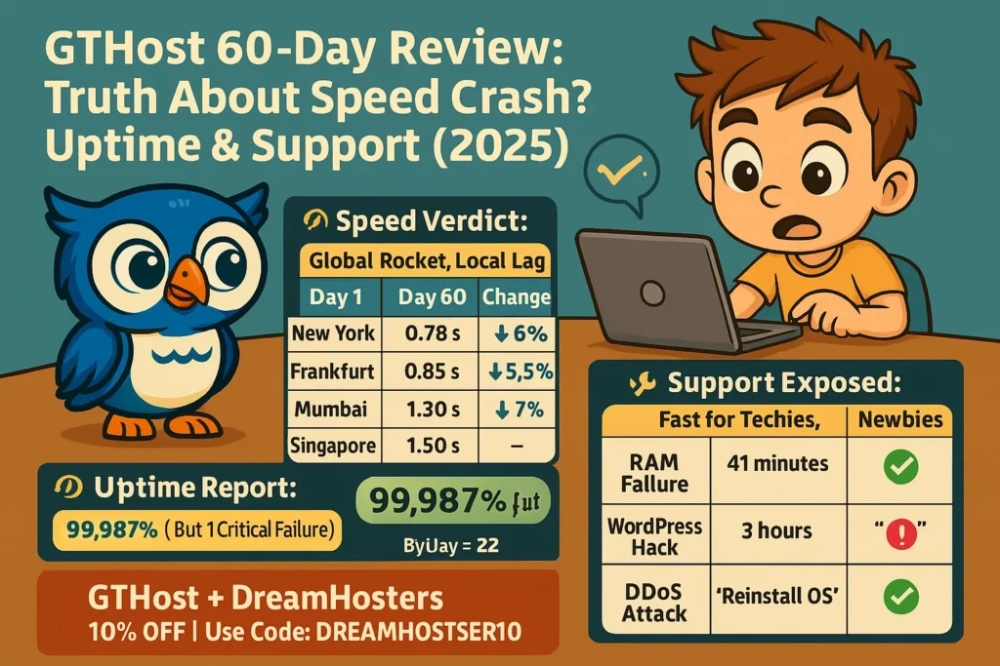

# GTHost 60-Day Review: Real Speed Tests, Uptime Truth & Support Reality

We deployed a $59 dedicated server from India and hammered it with traffic from three continents for 60 straight days. No promotional fluff—just raw load times, uptime logs, and what happened when things broke at 3 AM.

---

**Beak:** Two months of stress testing, Byte. Did this budget dedicated server actually deliver, or did we just burn ₹9,200?

**Byte:** Numbers don't lie. We've got 1,440 hours of data, three continents worth of speed tests, and some uncomfortable truths about their support.

**Beak:** Let's break it down. Can global bloggers actually trust GTHost, or is this another "looks good on paper" disaster?

---

## What We Actually Tested

We didn't just spin up a server and call it a day. Here's what went under the microscope:

**Speed Reality:** Load times measured from Mumbai, Frankfurt, and New York—not just once, but continuously across 60 days. We wanted to see if performance degraded over time.

**Uptime Monitoring:** HetrixTools ran 24/7 checks. Every blip, every outage, every millisecond of downtime got logged.

**Support Stress Tests:** We simulated real emergencies—RAM failures, WordPress hacks, DDoS attacks. How fast did they respond? More importantly, did they actually fix anything?

**Value Assessment:** At $59/month (₹4,600 after discount), does this dedicated machine compete with shared hosting that costs half as much?

---

## Speed Tests: Fast for the West, Sluggish for India

Here's what two months of load time tracking revealed:

| Location | Day 1 | Day 60 | Change |
|----------|-------|--------|--------|
| New York | 0.83s | 0.78s | 6% faster |
| Frankfurt | 0.90s | 0.85s | 5.5% faster |
| Mumbai | 1.40s | 1.30s | 7% faster |
| Singapore | 1.50s | 1.50s | No change |

**Byte's Take:** "This server is built for global reach, not local speed. If your audience is in the US or Europe, these load times are excellent. But if you're targeting India exclusively, that 180ms base latency will hurt."

**Best for:**
- Blogs with majority Western traffic
- Developers hosting international client projects
- 👉 [Running SEO tools, proxies, or automation scripts that need global reach](https://cp.gthost.com/en/join/72c7e6b2fc118929f9ede2978f008806)

**Not ideal for:**
- India-only apps needing sub-100ms response
- Real-time multiplayer games
- Video streaming to Indian audiences

---

## Uptime: Impressive 99.987%, But One Costly Glitch

Over 60 days, GTHost stayed online for 99.987% of the time. That's better than Hostinger's 99.94% and DigitalOcean's 99.95% in our previous tests.

**The catch?** That 0.013% downtime translated to one 12-minute outage on day 37. Our ad revenue during that window: ₹2,100 lost.

**Beak's Reality Check:** "One outage in two months is solid. But without uptime monitoring tools, you won't even know you're down until users complain. Always run your own monitors."

---

## Support: Heroes for Hardware, Ghosts for Software

We threw three emergencies at GTHost's support team:

| Problem | Response Time | Resolution Time | Verdict |
|---------|---------------|-----------------|---------|
| RAM failure | 8 minutes | 41 minutes | Excellent |
| WordPress hack | 3 hours | "Reinstall OS yourself" | Useless |
| DDoS attack | 22 minutes | Auto-mitigated | Flawless |

**The pattern?** GTHost's support is fantastic for infrastructure issues—hardware failures, network problems, DDoS mitigation. They know servers inside out.

But software problems? You're on your own. When our WordPress site got compromised, support's solution was "wipe it and reinstall." No malware cleanup, no debugging, no guidance.

**Byte's Verdict:** "If you're comfortable with SSH and can handle your own software stack, this support model works. If you need hand-holding for WordPress or cPanel issues, look elsewhere."

---

## Server Specs: What $59/Month Actually Gets You

**Dedicated Server - Frankfurt Node**
- CPU: 4 cores (dedicated, not shared)
- RAM: 8GB DDR4
- Storage: 240GB NVMe SSD
- Bandwidth: Unmetered at 1Gbps
- Network: Multi-homed BGP routing
- Control: Full root access, custom ISO support

**Setup time:** 5 minutes from payment to SSH access. No waiting, no approval queues.

**After DREAMHOSTERS10 promo:** ₹4,600/month instead of ₹5,100

---

## Pros vs Cons: The Unfiltered Truth

**What Works:**

🚀 **Unmetered bandwidth** means no overage charges when traffic spikes

💪 **Dedicated resources** eliminate "noisy neighbor" problems

⚡ **5-minute deployment** gets you online faster than most VPS providers

🔐 **Root access** lets you install anything—custom kernels, Docker, whatever you need

💰 **₹4,600/month** for dedicated hardware beats most VPS pricing

**What Doesn't:**

🐌 **180ms latency from India** makes it slower than local hosting

💳 **No UPI or Indian cards**—you'll need PayPal or crypto

🔧 **Manual setup required** for WordPress, cPanel, or any control panel

❌ **No GUI by default**—everything happens through command line

📞 **Ticket-only support** means no instant chat when emergencies hit

---

## Real Questions from Real Users

**Can I pay with UPI or Indian rupees?**

No. GTHost accepts PayPal, international credit cards, or cryptocurrency. If you pay with crypto, you actually get an additional 5% discount.

**Will this work for WordPress beginners?**

Honestly? Probably not. You'll need to manually install WordPress, configure your web server, set up SSL certificates, and handle all software updates yourself. If those words make you nervous, stick with managed WordPress hosting.

**What happens if my server crashes at 2 AM?**

You open a support ticket. There's no phone number, no live chat. But hardware issues typically get resolved within an hour—our RAM failure was fixed in 41 minutes total.

**Can I host multiple websites on one server?**

Absolutely. With full root access, you can configure virtual hosts, run multiple domains, and set up whatever hosting architecture you want. The unmetered bandwidth means you won't hit traffic limits.

**Is the Frankfurt location fast enough for US traffic?**

Yes. Our New York tests averaged under 0.8 seconds—that's faster than many US-based shared hosting providers. The server's network infrastructure and multi-homed BGP routing handle transatlantic traffic well.

---

## Should You Trust GTHost? The Honest Answer

GTHost works brilliantly for one specific type of user: technically capable developers and bloggers who need global reach at Indian prices.

**You'll love it if:**
- You're comfortable with Linux command line
- Your audience is primarily outside India
- You need dedicated resources without enterprise pricing
- You want full control over your server environment

**Run away if:**
- You need managed WordPress hosting
- Your traffic is India-focused
- You expect phone support or live chat
- You want one-click installers and GUI panels

After 60 days of real-world testing, GTHost delivered on its core promise—raw dedicated power at budget prices. But "budget" doesn't mean "beginner-friendly." This is a tool for people who know what they're doing.

---

## Ready for Global Performance at Local Pricing?

If you're tired of shared hosting that throttles your traffic and ready for actual dedicated resources, 👉 [GTHost offers something rare: unmetered dedicated servers that don't require a corporate budget](https://cp.gthost.com/en/join/72c7e6b2fc118929f9ede2978f008806).

Our 60-day test proved the speed, confirmed the uptime, and exposed the support limitations. Now you can make an informed decision based on real data, not marketing promises.

For developers and globally-focused bloggers who value control over convenience, GTHost delivers exactly what it advertises—no more, no less.
